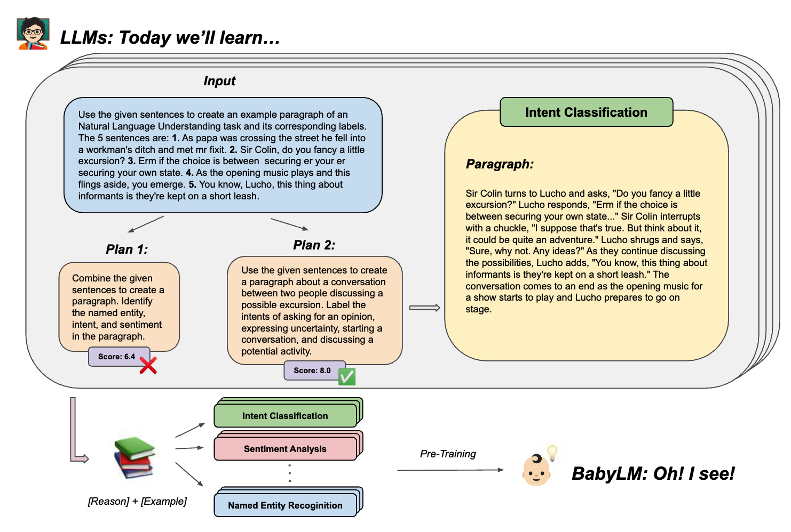

# Baby-CoThought

This repository contains the code for the paper "Baby's CoThought: Leveraging Large Language Models for Enhanced Reasoning in Compact Models". 

In this work, we apply our "CoThought" pipeline to pretrain a Baby Language Model (LM) with human-like smaller corpus data.

The pretraining data is provided by [Warstadt et al. (2023)](https://arxiv.org/abs/2301.11796) in the framework of the [BabyLM Challenge](https://babylm.github.io/), which has the goal of sample-efficient pretraining on a developmentally plausible corpus at a small human-like data scale.

## Contents

- `CNLU-EG`: Contains the code for the Creative NLU-Example Generation (CNLU-EG).
- `pretrain`: Contains the code and instructions for pretraining RoBERTa model.
